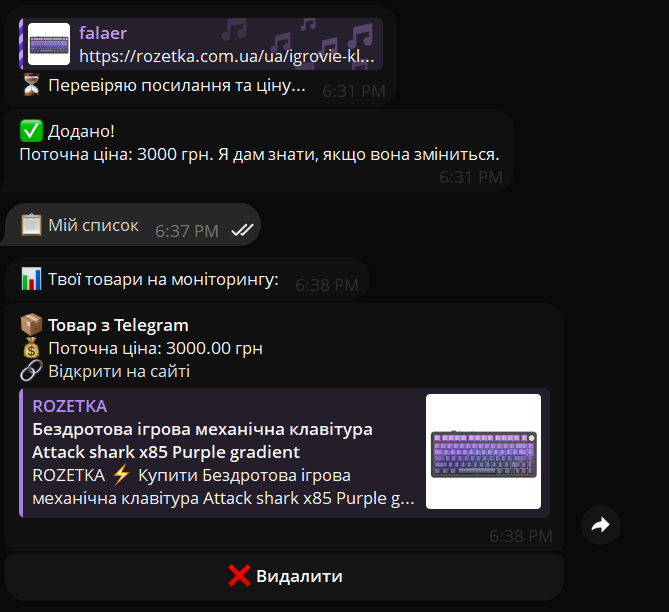

# 🛒 Universal Price Tracker & Telegram Bot

An automated monitoring system designed to track product prices across e-commerce platforms and send instant Telegram notifications when prices drop.

This project was built to demonstrate skills in web automation, web scraping, and API integration using Python and Django.

## 🚀 Key Features
* **Web Scraping:** Automatically extracts up-to-date pricing data from e-commerce websites (currently supports Rozetka).
* **Database Management (Django ORM):** Stores product history, target prices, and URLs via a user-friendly admin panel.
* **Telegram Integration:** A custom bot instantly notifies the user if a product's price changes.
* **Automated Checking:** Uses custom Django management commands (`update_prices`) to run the price-checking logic.

## 🛠 Tech Stack
* **Language:** Python 3
* **Framework:** Django (ORM, Admin Panel, Management Commands)
* **Scraping:** BeautifulSoup4, Requests, Regex
* **Integrations:** Telegram Bot API
* **Security:** python-dotenv (for keeping API keys and secrets safe)

## 📸 Demo

---
**Author:** Zakhar Zinchuk